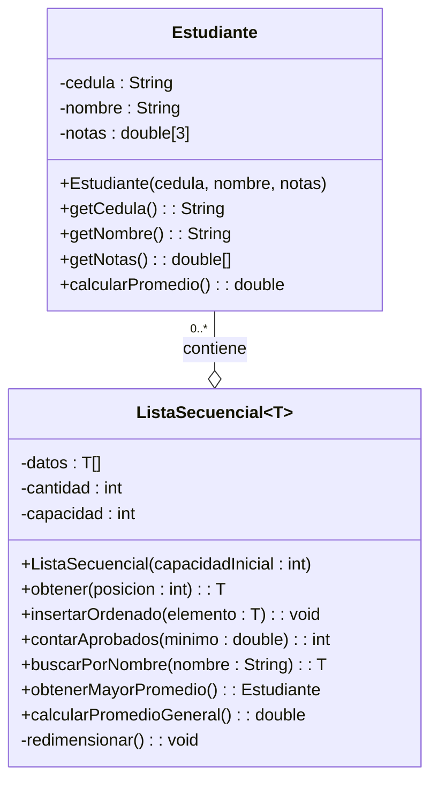

```mermaid
classDiagram
    class Estudiante {
        -cedula : String
        -nombre : String
        -notas : double[3]
        +Estudiante(cedula, nombre, notas)
        +getCedula() : String
        +getNombre() : String
        +getNotas() : double[]
        +calcularPromedio() : double
    }

    class ListaSecuencial~T~ {
        -datos : T[]
        -cantidad : int
        -capacidad : int
        +ListaSecuencial(capacidadInicial : int)
        +obtener(posicion : int) : T
        +insertarOrdenado(elemento : T) : void
        +contarAprobados(minimo : double) : int
        +buscarPorNombre(nombre : String) : T
        +obtenerMayorPromedio() : Estudiante
        +calcularPromedioGeneral() : double
        -redimensionar() : void
    }

    Estudiante "0..*" --o ListaSecuencial~T~ : contiene
```
